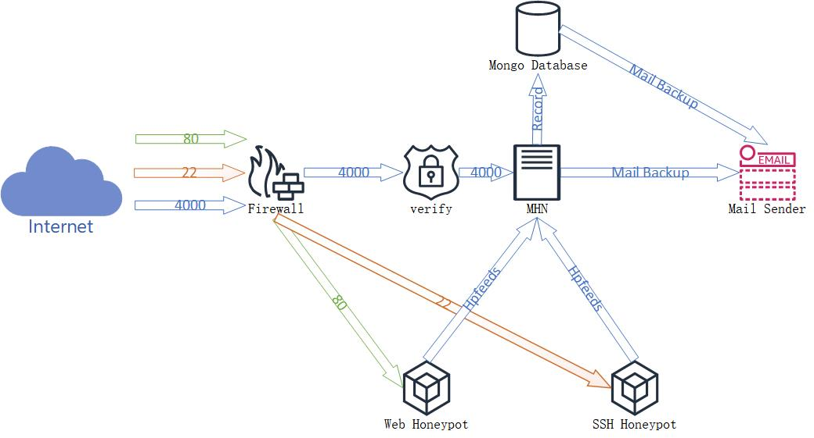

# Nectar-Guard
This is the collected data and description for Nectar-Guard

# Architecture
### Description
Nectar-Guard uses MHN as its main controller, and it captures WEB attacks and SSH attacks using modified Glastopf and modified cowrie. 

# Data
You can find all data in the data folder, and extract them for the attack informations.
Please Note: All files are encrypted, this is because the mailcious code uploaded to the honeypot might be detected and banned by github. The extraction password is 123.

# Better scripts
MHN offered some scripts to deploy honeypots quickly, unfortunately, those scripts are out-dated, thus they would meet "depeniency hell" problems. I rewrote part of them and you can find them in "scripts" folder.